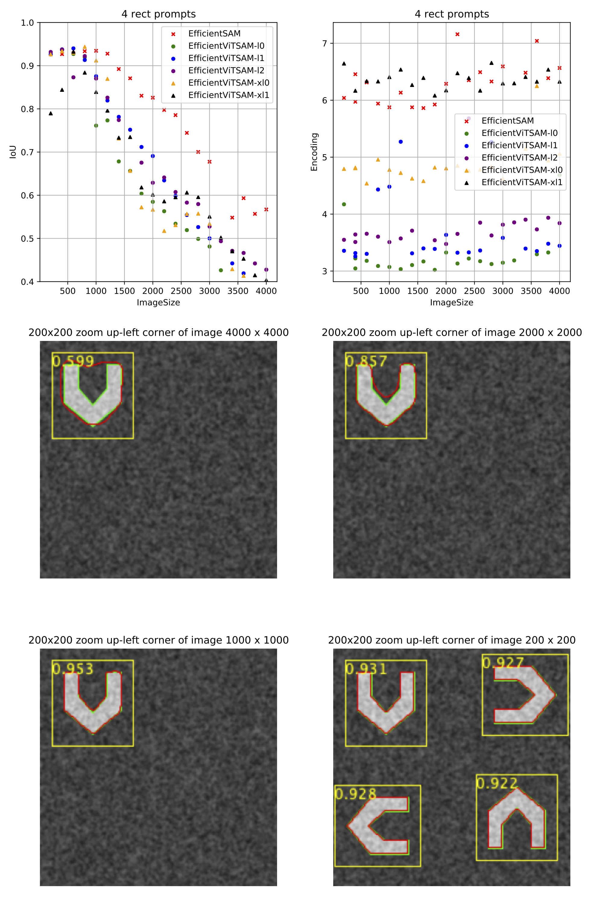
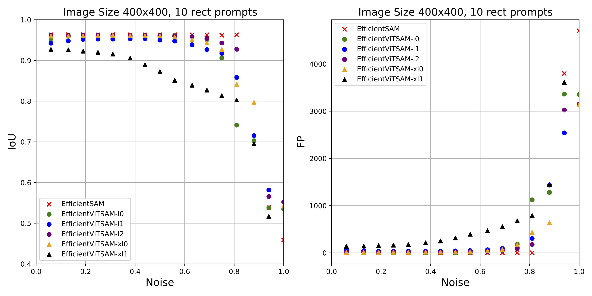
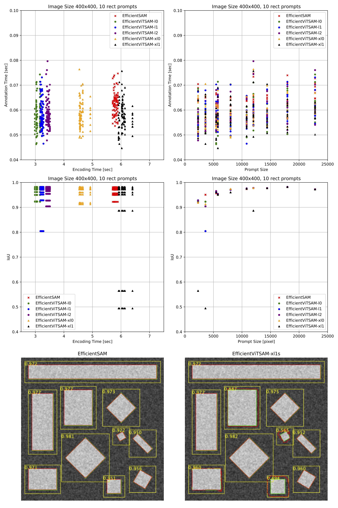

# SAMJ-Assessment

This repository contains a set of Java experiments to benchmark the performances of the Segment-Anything Models provided in [SAMJ](https://github.com/segment-anything-models-java/SAMJ-IJ).

> All the tests were done with the Preview version of SAMJ.

*Written by Daniel Sage, April 6, 2024*

### Check the impact of the image size 

### Check the noise robutness of the models 

### Check the impact of the variability of the SAM model answer

